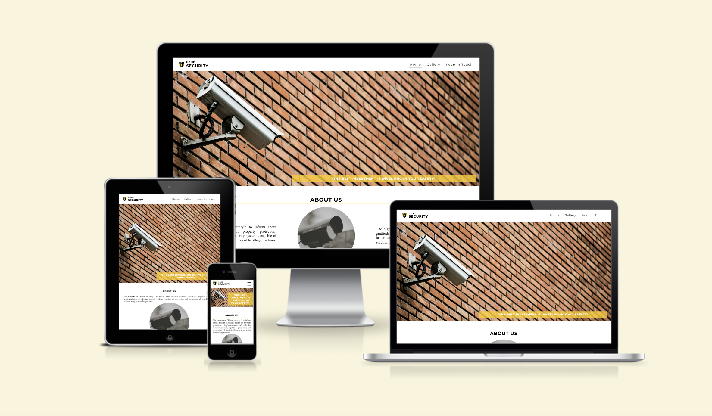

# Home Security

Home Security company is a family-run security systems and alarm installation business that was established in Ukraine 17 years ago. Currently the founders are opening a branch in Ireland. The website is designed to familiarise future customers with home security and the service they provide. The Home Security website is designed to be responsive so that users can view it on a variety of devices.

Visit the deployed site: [Home Security](https://liscannor.github.io/Home-Security-PP1-/index.html)

---
## CONTENTS

* [User Experience](#user-experience-ux)
  * [User Stories](#user-stories)

    ## User Experience (UX)

### User Stories

#### First Time Visitor Goals

* I want to know how this website help me with my question. I want to get the information I need.
* I want the site to be responsive to my device and easy to navigate.
* I want the site to make it easy to find contacts.

#### Returning Visitor Goals

* I want to be able to choose the type of security system that suits me interest.
* I want to be able to easily contact the company by phone or by e-mail.
* I want to be able to get expert advice on my question.

#### Frequent Visitor Goals

* I want to be able to leave my request for feedback.
* I want to be able to view the social media links to check for new video cameras and signalling devices.

- - -
