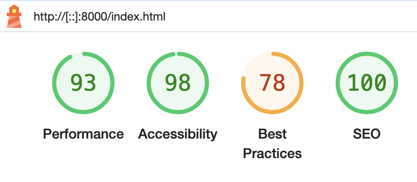
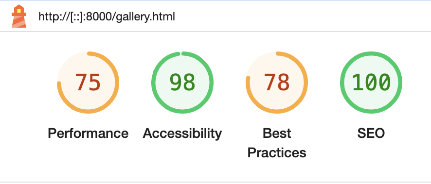

# Home Security

Home Security company is a family-run security systems and alarm installation business that was established in Ukraine 17 years ago. Currently the founders are opening a branch in Ireland. The website is designed to familiarise future customers with home security and the service they provide. The Home Security website is designed to be responsive so that users can view it on a variety of devices.

Visit the deployed site: [Home Security](https://liscannor.github.io/Home-Security-PP1-/index.html)

---
## CONTENTS

* [User Experience](#user-experience-ux)
  * [User Stories](#user-stories)

* [Design](#Design)
  * [Colour Scheme](#Colour-Scheme)
  * [Typography](#Typography)
  * [Imagery](#Imagery)
  * [Wireframes](#Wireframes)
  * [Features](#Features)
  * [Accessibility](#Accessibility)

* [Technologies Used](#Technologies-Used)
  * [Languages Used](#Languages-Used)
  * [Libraries & Programs Used](#Libraries-&-Programs-Used)

* [Deployment](#deployment)
    * [How to Deploy](##how-to-deploy)
    * [Local Development](#Local-development)
        * [How to Fork](#How-to-fork)
        * [How to Clone](#How-to-clone)

* [Testing](#Testing)
  * [W3C Validator](#W3C-Validator)
  * [Lighthouse](#Lighthouse)
  * [Manual Testing](#Manual-Testing)
  * [Solved Bugs](#Solved-Bugs)

* [Credits](#Credits)
    * [Content References](#Content-References)
    * [Media References](#Media-References)
    * [Acknowledgements](#Acknowledgements)
  
 - - -
  
    ## User Experience (UX)

### User Stories

#### First Time Visitor Goals

* I want to know how user-friendly the site is for my understanding. I want to get the information I need.
* I want the site to be responsive to my device and easy to navigate.
* I want the site to make it easy to find contacts.

#### Returning Visitor Goals

* I want to be able to choose the type of security system that suits me interest.
* I want to be able to easily contact the company by phone or by e-mail.
* I want to be able to get expert advice on my question.

#### Frequent Visitor Goals

* I want to be able to leave my request for feedback.
* I want to be able to view the social media links to check for new video cameras and signalling devices.

- - -

## Design

### Colour Scheme

The website uses 3 main colours that correspond to the colours used in the logo of the website. 

* I have used `#32362E` & `#000000` as the primary colour used for the text.
* I have used `#FEDD01` as the secondary colour used for  the sites background-colour and used for the accent colour the text.
* I have used `#ffffff` as the colour used for the site background-colour and used for the accent colour the text.

### Typography

[Google Fonts](https://fonts.google.com/) was used to import the chosen fonts for use in the site.

* For the Page Title I have used the google font [Montserrat](https://fonts.google.com/specimen/Montserrat?preview.text=Nadiiy&query=Montserrat&sort=popularity). It is a serif font.

* For the body of the page I have used the google font [Barlow Condensed](https://fonts.google.com/specimen/Barlow+Condensed?preview.text=Nadiiy&query=Barlow+Condensed+&sort=popularity). It is a sans-serif font.  

### Imagery

The logo was used with the permission of his owner. The images were taken from the [unsplash.com](https://unsplash.com/), that fit the theme of the site.

### Wireframes

Wireframe was created for only mobile version using [Figma](https://www.figma.com/).

### Features

The website is comprised of a home page, a gallery page, a keep in touch page and a thank you page.

All Pages on the website are responsive and have:

* A favicon in the browser tab.

* A responsive navigation bar at the top which allows the user to navigate through the site.  To the left of the navigation bar is a logo company together with the text Home Security. To the right of the navigation bar are the links to the websites pages (home, gallery, and ckeep in touch). On mobile devices the navigation links change to a burger toggler.

* A footer which contains two blocks. First blocks contains social media icon links to facebook, instagram and twitter. Second blocks shows contact information, such as phone number and email address with appropriate icons. The icons were used to keep the footer more clean, give more space and because they are universally recognisable.

#### Home Page.

  * Hero Section.
  The hero shows a image of a camara on the wall.
  * About Us Section.
  This section is broken down into three subsections: two paragraphs and one image. Text describe the company and its mission.
  * Why Choose Us Section gives the user information about benefits, if he/she choose this company. Its is presented as text and the icons.

#### Gallery Page.

    Gallery page includes a set of pictures that show what the company does and what services it provides.

#### Keep In Touch Page.

* Background picture related to the company's activity.
* This section-form gives the user opportunity to leave a request to be contacted by a company employee.

#### Thank you Page.

* Background of the page is white color for not to overload the user's perception and not to distract his attention from the main thing.
* The section has only two headers that give the users feedback on their subscription.

#### Future Implementations

In future implementations I would like to:

1 Create a page with product cards and services.
2 Give users the option to order goods from the site.
3 Create a basket of goods and services.

### Accessibility

I have been mindful during coding to ensure that the website is as accessible friendly as possible. I have achieved this by:

* Using semantic HTML.
* Using descriptive alt attributes on images on the site.
* Using a hover state on all buttons on the site to make it clear to the user if they are hovering over a button.
* Ensuring that there is a sufficient colour contrast throughout the site.
* Ensuring menus are accessible by marking the current page as current for screen readers.

- - - 

## Technologies Used

### Languages Used

HTML5 and CSS were used to create this website.

### Libraries & Programs Used

Figma - Used to create desing and resize images.

Git - For version control.

Github - To save and store the files for the website.

VS Code - To write the code.

Google Fonts - To import the fonts used on the website.

Font Awesome - For the iconography on the website.

Google Dev Tools - To troubleshoot and test features, solve issues with responsiveness and styling.

[Fotor](https://www.fotor.com/) - To compress images and change to webp format.

[Can I Include](https://caninclude.glitch.me/) - To check tags nesting.

W3C Validator - For validating the HTML and CSS code.

W3C CSS - For validating the CSS code.

Google Lighthouse - For auditing the website.

- - - 

## Deployment 

### How to deploy

The site is deployed using GitHub Pages - [Home Security](https://liscannor.github.io/Home-Security-PP1-/index.html).

To Deploy the site using GitHub Pages:

1. Login (or signup) to Github.
2. Go to the repository for this project, Home-Security-PP1.
3. Click the settings button.
4. Select pages in the left hand navigation menu.
5. From the source dropdown select main branch and press save.
6. The site has now been deployed, please note that this process may take a few minutes before the site goes live.

### Local Development

#### How to Fork

To fork the repository:

1. Log in (or sign up) to Github.
2. Go to the repository for this project, [liscannor/Home-Security-PP1-](https://github.com/liscannor/Home-Security-PP1-)
3. Click the Fork button in the top right corner.

#### How to Clone

To clone the repository:

1. Log in (or sign up) to GitHub.
2. Go to the repository for this project, [liscannor/Home-Security-PP1-](https://github.com/liscannor/Home-Security-PP1-)
3. Click on the code button, select whether you would like to clone with HTTPS, SSH or GitHub CLI and copy the link shown.
4. Open the terminal in your code editor and change the current working directory to the location you want to use for the cloned directory.
5. Type 'git clone' into the terminal and then paste the link you copied in step 3. Press enter.

- - - 

## Testing

Testing was ongoing throughout the entire build. I utilised Chrome developer tools while building to pinpoint and troubleshoot any issues as I went along.  I deployed my site halfway through to test on real-world devices. These devices included:  
* iPhone 11 Pro
* iPhone 13 Pro Max
* iPhone 15 Pro Max
* Xiaomi Redmi 10
* iPad 9 
* Laptop Mac Air M2

 The browsers used were:  
* Chrome  
* Safari

In my mid project meeting with my mentor, he advised me to add a popup after submitting the form.

### W3C Validator

The W3C validator was used to validate the HTML on all pages of the website. It was also used to validate CSS in the style.css file.

* [Index Page HTML](documentacion/w3c_index.png) - Passed, no errors found.
* [Gallery Page HTML](documentacion/w3c_gallery.png) - Passed, no errors found.
* [Keep In Touch Page HTML](documentacion/w3c_keppintouch.png) - Passed, no errors found.
* [Thank You Page HTML](documentacion/w3c_thankyou.png) - Passed, no errors found.
* [style.css CSS](documentacion/w3c_css.png) - Passed, no errors found.

The W3C CSS was used to validate CSS in the style.css file.

* [style.css CSS](documentacion/css_valid.jpeg) - Passed, no errors found.

### Lighthouse

I used Lighthouse within the Chrome Developer Tools to test the performance, accessibility, best practices and SEO of the website.

### Desktop Results

### Mobile Results

### MANUAL TESTING

#### Testing User Stories

`First Time Visitors`

|  Goals | How are they achieved? |
| :--- | :--- |
| I want to know how user-friendly the site is for my understanding. I want to get the information I need. | In the top of website users can easily use the site navigation. In the bottom of website users can easily use social links, where they can see the work of the company provides. |
| I want the site to be responsive to my device and easy to navigate. | The website is fully responsive. |
| I want the site to make it easy to find contacts. | The contact information provided at the bottom of the site. |

`Returning Visitors`

| Goals | How are they achieved? |
| :--- | :--- |
| I want to be able to choose the type of security system that suits me interest.| The Keep In Touch page allows users to choose the type of security that is suitable for them. |
| I want to be able to easily contact the company by phone or by e-mail. | A phone number and e-mail address are provided in the footer of the web page. Users can easily contact the company by choosing on one of the two options. |
| I want to be able to get expert advice on my question. | Users can usethe contact phone number or email address indicated in the footer of all pages. Anather way they can use Keep In Touch form to contact with company. |

`Frequent Visitors`

| Goals | How are they achieved? |
| :--- | :--- |
| I want to be able to leave my request for feedback. | Users are able to leave their request for feedback through the contact-form on the Keep In Touch Page. |
| I want to be able to view the social media links to check for new video cameras and signalling devices. | Users can find the social media links at the bottom of the site. |

- - -

| Feature | Expected Outcome | Testing Performed | Result | Pass/Fail |
| --- | --- | --- | --- | --- |
| Website logo | Link directs the user back to the home page | Clicked Logo | Home page reloads | Pass |
| Home Link in the navigation bar | The link worked as expected, the link leading to internal Home page of the site opened correctly | Clicked on the link | The Home page opens | Pass |
| Gallery Link in the navigation bar | The link worked as expected, the link leading to internal Gallery page of the site opened correctly | Clicked on the link | The Gallery page opens | Pass |
| Keep In Touch Link in the navigation bar | The link worked as expected, the link leading to internal Keep In Touch page of the site opened correctly | Clicked on the link | The Keep In Touch page opens | Pass |
| Keep In Touch form | The each input: name, surname, phone, email and type of security worked as expected, If the user misses one blank field, the form will not be submitted | Filled the inputs | The form can then be submitted | Pass |
| Submit Button | Directs the user to the Thank You page | Clicked on button | The Thank You page opens | Pass |
| Facebook Link in the footer | The link worked as expected, the link leading to external pages opened correctly in a seperate browser tab | Clicked on the link | Facebook page opens | Pass |
| Instagram Link in the footer | The link worked as expected, the link leading to external pages opened correctly in a seperate browser tab | Clicked on the link | Instagram page opens | Pass |
| Twitter Link in the footer | The link worked as expected, the link leading to external pages opened correctly 
in a seperate browser tab | Clicked on the link | Twitter page opens | Pass |
| Call Link in the footer | The link worked as expected, the link makes phone number company clickable | Clicked on the link | Connecting to a specified telefone number | Pass |
| Email Link in the footer | The link worked as expected, the link The link prompts the user to open the mail and send an email to the specified email address | Clicked on the link | E-mail opens | Pass |

### Solved Bugs

1. Logo and text in the header were not on the same line and no styles could help. A friend gave me a tip to change the html structure: remove the list where these elements were. Instead just put the logo and text in one link. It was a great solution.
2. In the about section of the desktop screen, the items should display in a single line in the centre. I used align-items:baseline and was sure it was a good solution and spent a lot of time applying other styles to align the items vertically. I should have just used align-items:centre though.
3. The form on screens larger than 768px had to fixed to the centre of the screen. I didn't know how to implement it. I found the solution on Google. I applayed to the form the set styles:top: 50%;left: 50% transform: translate(-50%, -50%);.

- - -

## Credits  
  
### Content References

- All content written for the website is by myself, exept for the Thank You Page (the idea I saw at the Kera Cudmore) is not fictional. Such a company exists and the business is in the planning stages.
- [Code Institute](https://codeinstitute.net/ie/) for their HTML/CSS learning material and 'content zoom' module in the Love Running project.
- [GoIT](https://goit.global/ua/) for instalilng the developer inviroment.
- [W3Schools](https://www.w3schools.com/) for additional learning material.
- Amy from Code Institute Facilitator our group for helping me with with some questions about breakpoints, README and free images websites.
- [Network security](https://alarms.networksecurity.ie/) Some part of design inspired by Network security website.
- [Kera Cudmore - Creating your First README](https://github.com/kera-cudmore/readme-examples) for README structure and Markdown guidance. 
- [Kera Cudmore](https://github.com/kera-cudmore/Bully-Book-Club/tree/main) for the idea of an additional page (Thank you).
  
  ### Media References
  
- [Unsplash](https://unsplash.com/) for all images used on this site. 
- [Font Awesome](https://fontawesome.com/) for the icons used in the footer of this site.
- [Figma](https://www.figma.com/) for the make desing and resize images.
- [Fotor](https://www.fotor.com/) for the optimise images used in this site.

### Acknowledgements
- I would like to acknowledge my Code Institute mentor, Jubril Akolade, for his clear explonation, his help, positive attitude and encouragement on this project.
- My husband for tips, advices and free time for coding throughout the project.

  

